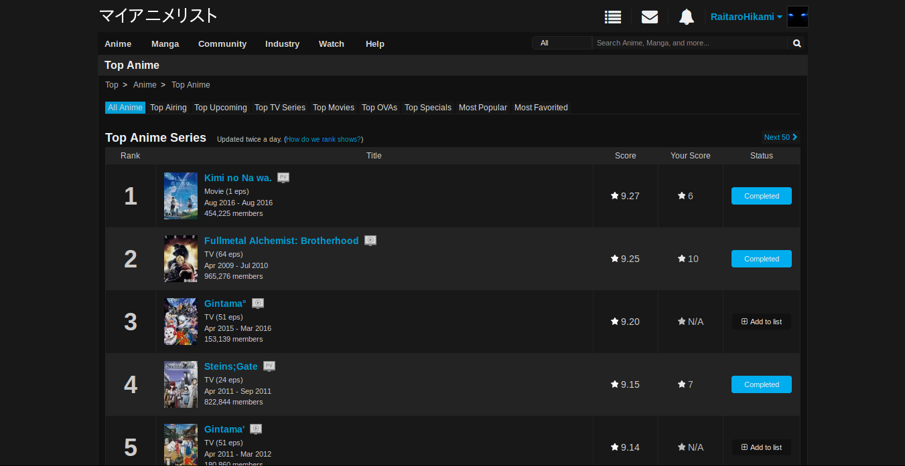

# MyAnimeList-DeepDark

Satisfy thy craving for anime and organization. May the dark be kinder on thine eyes. (MyAnimeList Dark Theme)

This is a dark theme for MyAnimeList inspired by [FT DeepDark](https://addons.mozilla.org/en-US/firefox/addon/ft-deepdark/?src=search).

Credit for some images and code (ads removal) to [Dark/Night MyAnimeList](https://userstyles.org/styles/120493/dark-night-myanimelist).

Also, credit where credit is due for the color palettes down bellow. ([@KDE](https://github.com/KDE), [@horst3180](https://github.com/horst3180), [@linuxmint](https://github.com/linuxmint), [Firefox](https://www.mozilla.org/en-US/firefox/new/), [YouTube](https://www.youtube.com/) and [Discord](https://discordapp.com/))

Theme as a userstyle [here](https://userstyles.org/styles/146429/myanimelist-deepdark).

### **You can also install all my themes at once from [here](https://gitlab.com/RaitaroH/Import-All-Deepdark).**

NB: The edit anime entry frame is not themed due to a bug in firefox/forks of firefox. The frame is themed but does not appear as such. You can see in the following images: 

https://i.imgur.com/cn7tICc.png the frame not themed

https://i.imgur.com/hQNRQqi.png the frame themed

# Screenshots
Main page

I offer the normal logo or 2 katakana variants [マイアニメリスト](./Images/logo_katakana.png) (default) and even [私のアニメリスト](./Images/logo_katakana_V2.png).

Top anime page

Reviews

Seasonal anime

The forum

News

Character and people pages

# Colors
Colors Showcase (the colors are available in the code; different colors can be used)

